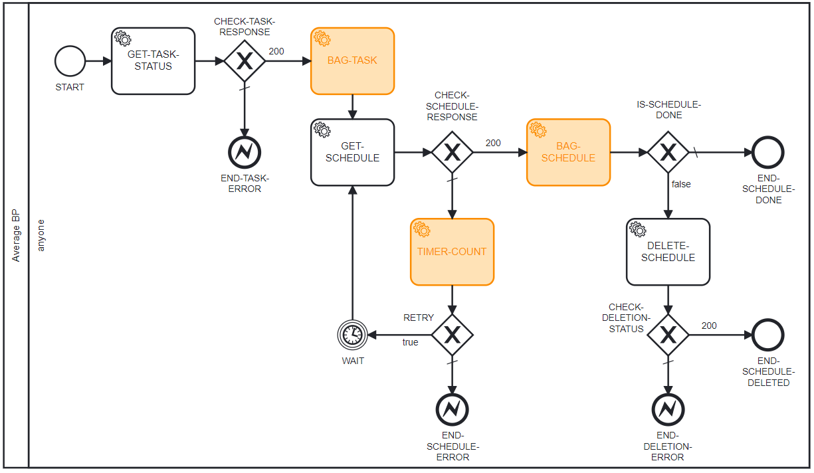
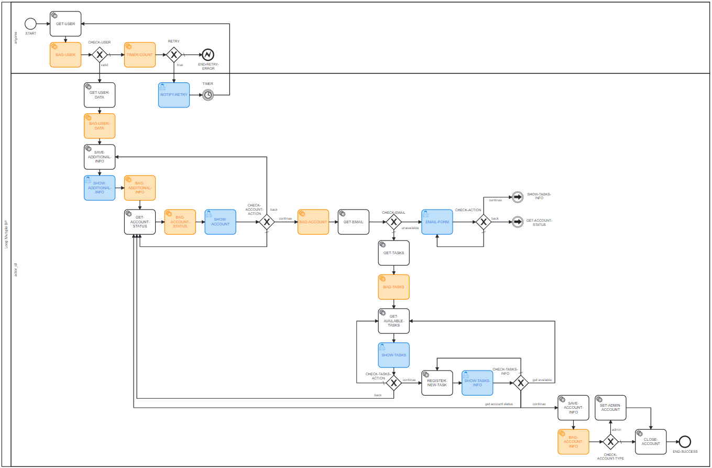

# test-core
Core library with testing functionalities for flowbuild

 
[](https://github.com/semantic-release/semantic-release) 

## Installation
```
npm install @flowbuild/test-core
```

## Usage (getAllPaths)
You can use this plugin to get the paths ignoring or not the present loops, as 
follows. 

```js
// ignoring loops - add 'true' as the second argument of function 'getAllPaths'
const { getAllPaths } = require('@flowbuild/test-core');
const allPaths = getAllPaths(blueprint, true);

// counting paths with loops - just pass the first argument (false is the default 
// for the second argument)
const { getAllPaths } = require('@flowbuild/test-core');
const allPaths = getAllPaths(blueprint);

/*
note that 'blueprint' must be a valid blueprint inside flowbuild's pattern, i.e, 
must have the valid properties 'name', 'description' and 'blueprint_spec' in it.
*/
```

## Usage (getLoops)
You can use this plugin to get all loops present in a blueprint.

```js
const { getLoops } = require('@flowbuild/test-core');
const allLoops = getLoops(blueprint);

/*
note that 'blueprint' must be a valid blueprint inside flowbuild's pattern, i.e, 
must have the valid properties 'name', 'description' and 'blueprint_spec' in it.
*/
```

## Tested Blueprints Patterns (Diagrams Images)

### Number of paths: 1 | Number of loops: 0


### Number of paths: 2 | Number of loops: 0


### Number of paths: 4 | Number of loops: 0


### Number of paths: 8 (Counting loop); 4 (Ignoring loop) | Number of loops: 1


### Number of paths: 8 (Counting loop); 6 (Ignoring loop) | Number of loops: 1


### Number of paths: 9 (Counting loop); 5 (Ignoring loop) | Number of loops: 1


### Number of paths: 60 (Counting loop); 5 (Ignoring loop) | Number of loops: 11
